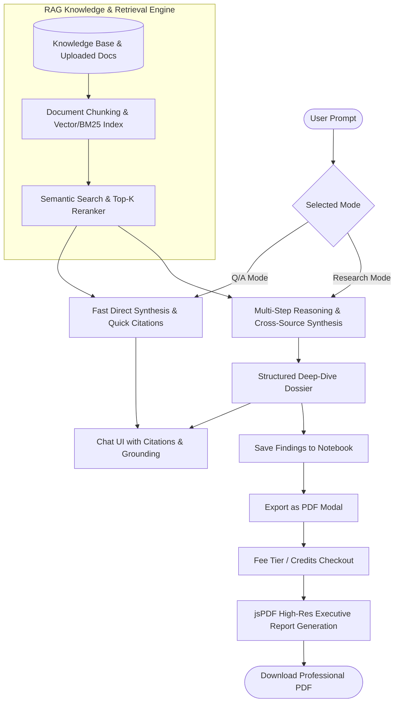

# Implementation Plan - Retrieval-Augmented Generation (RAG) Chatbot with Q/A & Research Modes

Develop a state-of-the-art, rich RAG Chatbot component for the application supporting **Q/A Mode** (fast answers, direct citations) and **Research Mode** (multi-step reasoning, deep citations, findings notebook, and paid PDF report export with payment checkout).

## Proposed Architecture & Features

---

## User Review Required

> [!NOTE]
> - **Dual Mode Strategy**: 
>   - **Q/A Mode**: Lightweight, low-latency, concise grounding for rapid queries.
>   - **Research Mode**: Comprehensive multi-step reasoning, cross-document comparison, saved findings notebook, and exportable research dossier.
> - **Monetization / Paid PDF Export**: Includes a full simulated payment & credit checkout flow (Tier selection, Card / Mobile Money / System Credits, instant receipt, and vector-rendered PDF download).
> - **Knowledge Base**: Built-in comprehensive industry knowledge repository (Gaming regulations, Anti-fraud, Payout standards, User retention benchmarks) + Custom Document Uploader.

---

## Proposed Changes

### 1. Models & Types
#### [NEW] [app/models/rag.ts](file:///Users/emmanueladdo-odame/Documents/e/rhyoliteprime/chop-money-raffle/ui/app/models/rag.ts)
- Define TypeScript interfaces for `ChatMessage`, `Citation`, `KnowledgeSource`, `Chunk`, `ThoughtStep`, `Finding`, `ChatSession`, `PdfExportTier`, `PaymentMethod`, and `ExportOrder`.

---

### 2. Core Engines & Composables
#### [NEW] [app/composables/useRagEngine.ts](file:///Users/emmanueladdo-odame/Documents/e/rhyoliteprime/chop-money-raffle/ui/app/composables/useRagEngine.ts)
- Comprehensive pre-loaded knowledge corpus (Gaming compliance, Raffle mechanics, RNG security, Financial disbursement laws, Anti-fraud, Consumer protection).
- Client-side vector similarity / BM25 hybrid retrieval engine with relevance scoring and chunk highlight extraction.
- Response generators for both **Q/A** and **Research** modes with realistic streaming emulation.

#### [NEW] [app/composables/useRagChat.ts](file:///Users/emmanueladdo-odame/Documents/e/rhyoliteprime/chop-money-raffle/ui/app/composables/useRagChat.ts)
- Multi-session chat management, message threading, active knowledge sources filter, credits balance system (100 free credits + top-up), and findings bookmarks.
- LocalStorage persistence for complete session and findings restoration.

#### [NEW] [app/composables/usePdfExport.ts](file:///Users/emmanueladdo-odame/Documents/e/rhyoliteprime/chop-money-raffle/ui/app/composables/usePdfExport.ts)
- High-fidelity PDF report generator using `jspdf` and custom layout formatting.
- Creates multi-page executive dossiers with cover page, metadata, executive summary, structured findings, citations table, and audit trail.

---

### 3. Components
#### [NEW] [app/components/rag/RagChatbot.vue](file:///Users/emmanueladdo-odame/Documents/e/rhyoliteprime/chop-money-raffle/ui/app/components/rag/RagChatbot.vue)
- Main RAG Chatbot container with top navigation, mode indicator, message list, streaming animation, prompt input with suggestion chips, and responsive controls.

#### [NEW] [app/components/rag/RagModeToggle.vue](file:///Users/emmanueladdo-odame/Documents/e/rhyoliteprime/chop-money-raffle/ui/app/components/rag/RagModeToggle.vue)
- Animated switch between **Q/A Mode** (cyan/emerald lightning theme) and **Research Mode** (amber/gold deep-search theme) with feature badges.

#### [NEW] [app/components/rag/RagMessageItem.vue](file:///Users/emmanueladdo-odame/Documents/e/rhyoliteprime/chop-money-raffle/ui/app/components/rag/RagMessageItem.vue)
- Markdown rendering, multi-step thought process collapsible accordion, interactive citation badges (hover preview & click for chunk inspector), "Save to Findings Notebook" button, copy, and TTS.

#### [NEW] [app/components/rag/RagCitationModal.vue](file:///Users/emmanueladdo-odame/Documents/e/rhyoliteprime/chop-money-raffle/ui/app/components/rag/RagCitationModal.vue)
- Interactive chunk inspector dialog showing source document, page number, relevance match %, and highlighted context.

#### [NEW] [app/components/rag/RagKnowledgeManager.vue](file:///Users/emmanueladdo-odame/Documents/e/rhyoliteprime/chop-money-raffle/ui/app/components/rag/RagKnowledgeManager.vue)
- Drawer to browse, enable/disable knowledge sources, view chunk counts, and upload custom documents for real-time indexing.

#### [NEW] [app/components/rag/RagFindingsNotebook.vue](file:///Users/emmanueladdo-odame/Documents/e/rhyoliteprime/chop-money-raffle/ui/app/components/rag/RagFindingsNotebook.vue)
- Persistent Research Notebook to view bookmarked findings, add custom notes, tag insights, and prepare for PDF export.

#### [NEW] [app/components/rag/RagPdfExportModal.vue](file:///Users/emmanueladdo-odame/Documents/e/rhyoliteprime/chop-money-raffle/ui/app/components/rag/RagPdfExportModal.vue)
- Paid PDF Export dialog with tier selector (Standard, Executive Dossier, Whitepaper), pricing calculation, payment method selection (Credits, Card, Mobile Money), fee receipt, and instant PDF download.

#### [NEW] [app/components/rag/RagSessionSidebar.vue](file:///Users/emmanueladdo-odame/Documents/e/rhyoliteprime/chop-money-raffle/ui/app/components/rag/RagSessionSidebar.vue)
- Thread history sidebar with search, mode filters, rename, delete, and session export/import.

#### [NEW] [app/components/rag/RagWidgetLauncher.vue](file:///Users/emmanueladdo-odame/Documents/e/rhyoliteprime/chop-money-raffle/ui/app/components/rag/RagWidgetLauncher.vue)
- Floating button on the layout to summon the AI assistant anytime as a floating glass widget or expand to full-screen.

---

### 4. Pages & Navigation
#### [NEW] [app/pages/research-ai.vue](file:///Users/emmanueladdo-odame/Documents/e/rhyoliteprime/chop-money-raffle/ui/app/pages/research-ai.vue)
- Full-page dedicated RAG AI workstation with split view, stats bar, and direct access to Knowledge Base and Research Notebook.

#### [MODIFY] [app/components/Sidebar.vue](file:///Users/emmanueladdo-odame/Documents/e/rhyoliteprime/chop-money-raffle/ui/app/components/Sidebar.vue)
- Add "RAG AI Assistant" link with badge to the sidebar navigation.

#### [MODIFY] [app/layouts/default.vue](file:///Users/emmanueladdo-odame/Documents/e/rhyoliteprime/chop-money-raffle/ui/app/layouts/default.vue)
- Mount `RagWidgetLauncher` globally so the chatbot is accessible across all dashboard pages.

---

## Verification Plan

### Automated Verification
- Run `npm run build` or `npx nuxi typecheck` to verify complete TypeScript compilation and Nuxt bundle validity.
- Verify zero syntax or template errors.

### Manual / Browser Verification
- Launch the application and test:
  1. **Q/A Mode**: Submit queries (e.g. "What are the rules for daily raffle draws?"), verify fast streaming response, citation tags, and chunk inspector modal.
  2. **Research Mode**: Toggle to Research Mode, submit an in-depth query (e.g. "Provide a comprehensive audit of RNG security and anti-fraud compliance for instant win games"), verify step-by-step reasoning steps, rich structured dossier, and source list.
  3. **Findings Notebook**: Click "Save to Notebook" on key findings, add personal notes, verify persistence in history.
  4. **PDF Export & Fee Checkout**: Open PDF Export dialog, select Executive Dossier tier, test payment checkout with credits/momo/card, verify receipt and check the generated PDF file formatting.
  5. **Knowledge Base Manager**: Add custom documents and verify they are retrieved during subsequent prompts.
  6. **Floating Widget vs Full Page**: Test both the full-page `/research-ai` view and the floating drawer widget across different routes.
